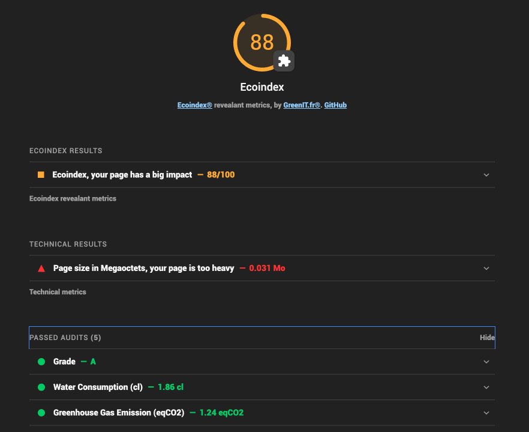
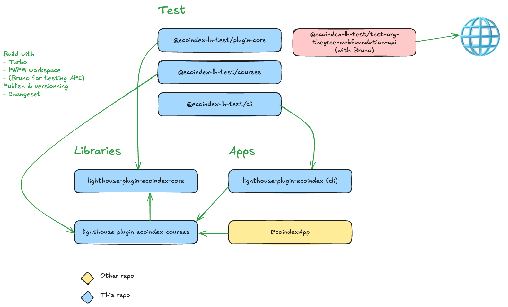

_Summary of results_

# `LHEx` — lighthouse-plugin-ecoindex

| Package                              | Version                                                                                                    |
| ------------------------------------ | ---------------------------------------------------------------------------------------------------------- |
| `lighthouse-plugin-ecoindex`         |                  |
| `lighthouse-plugin-ecoindex-core`    |        |
| `lighthouse-plugin-ecoindex-courses` |  |

_Details of plugin results_

[Full documentation and examples](https://cnumr.github.io/lighthouse-plugin-ecoindex/)

## CHANGELOG

- `BREAKING CHANGES` between V5 and V6:
  - Switch to a monorepo
  - Using `lighthouse-plugin-ecoindex-core` instead of `lighthouse-plugin-ecoindex` in CI/CD see [Usage with lighthouse-ci in CI/CD](https://lighthouse-ecoindex.greenit.eco/guides/3-lighthouse-ci/)
- `BREAKING CHANGES` between V4 and V5 see: [commit description](https://github.com/cnumr/lighthouse-plugin-ecoindex/commit/e4fe1d6f754dda828ab3e46584bd21ef55c35ada)
- `BREAKING CHANGES` between V3 and V4 see: [commit description](https://github.com/cnumr/lighthouse-plugin-ecoindex/commit/77775177677b6499b8be04a8146d97ee1529a76a)

## FILES

> CHANGELOG auto-generate: [CHANGELOG.md](./lighthouse-plugin-ecoindex/CHANGELOG.md)  
> CONTRIBUTING: [CONTRIBUTING.md](./CONTRIBUTING.md)

_Details of plugin results_

## Stack

