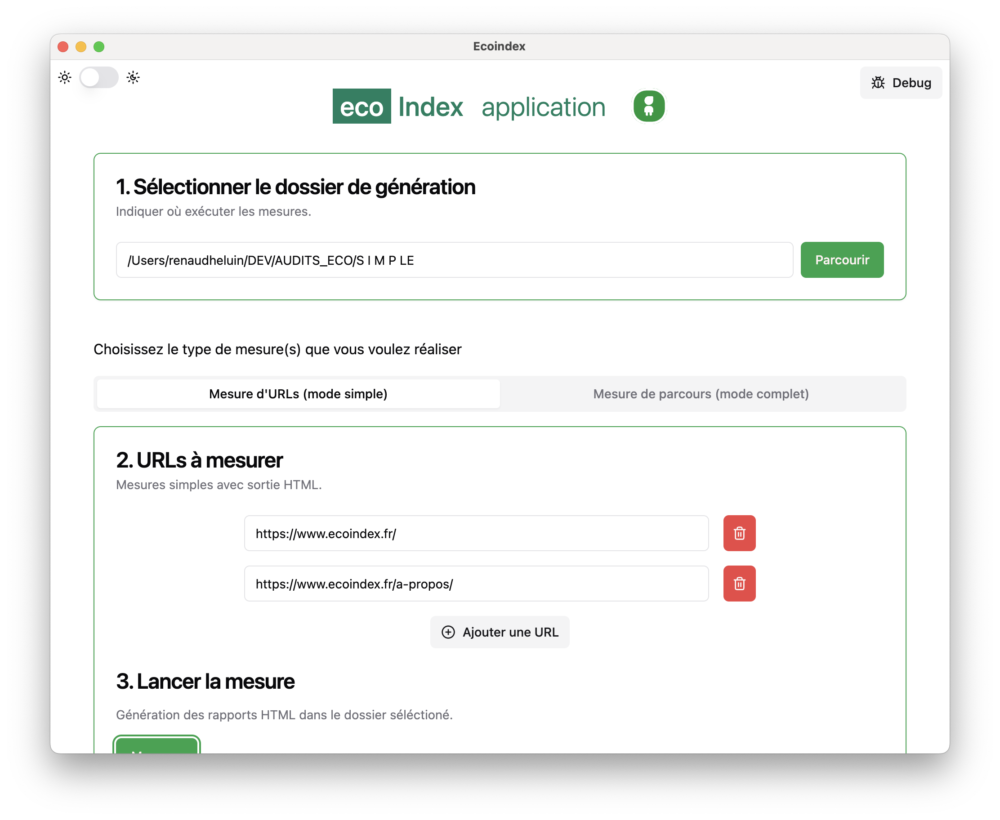

# L'Application desktop, EcoindexApp

Une application (créé en [Electron](https://www.electronjs.org/)) est disponible afin d'utiliser **lighthouse-plugin-ecoindex** simplement, **sans besoin utiliser les lignes de commandes dans le terminal**.

L'application est téléchargeable sur GitHub. Vous trouverez plusieurs version de celle-ci. Installez celle adaptée à votre ordinateur.

- **Linux (Ubuntu)**: ecoindex-app\_`{version}`\_amd64.deb (non testé)
- **Linux (Red Hat)**: ecoindex-app-`{version}`-1.x86_64.rpm (non testé)
- **Windows** ecoindex-app-`{version}`-win32-x64-setup.exe ([Information d'installation](./01-installation.md/#windows))
- **Mac (M1)**: EcoindexApp-`{version}`-arm64.dmg
- **Mac (Intel)**: EcoindexApp-`{version}`-x64.dmg

[!ref icon="desktop-download" target="blank" text="Télécharger l'application"](https://github.com/cnumr/EcoindexApp/releases/latest)

