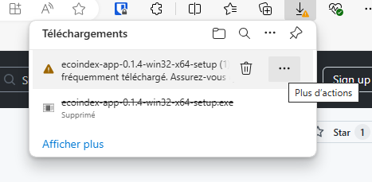
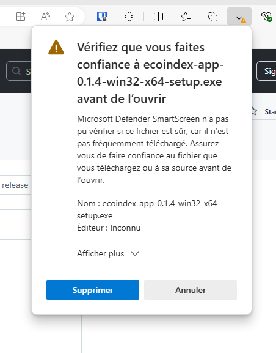
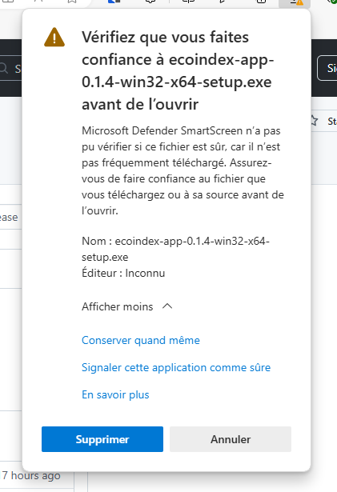
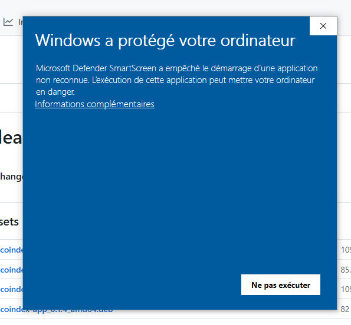
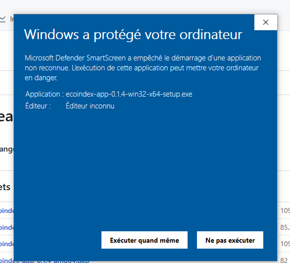

# Processus d'installation

[!ref icon="desktop-download" target="blank" text="Télécharger l'application"](https://github.com/cnumr/EcoindexApp/releases/latest)

## Commun

Après l'installation, lors du premier lancement, et lors des lancements suivant un ensemble d'actions et de vérifications sont réalisés.

Les éléments suivants seront vérifiés et installés :

- La présence de **NodeJS** et sa version ;
- Un **navigateur sans interface** (Chrome headless avec Puppeteer) pour réaliser les mesures ;
- **Notre outil de mesure** `lighthouse-plugin-ecoindex`.

Suivant votre configuration, des actions seront peut-être à réaliser manuellement, comme l'**installation de NodeJS**.

Toujours suivant votre configuration, **votre mot de passe administateur sera peut-être demandé** pour corriger un problème inhérent à l'installation manuelle de NodeJS sur Mac.

!!!info Mise à jour automatique
Une fois l'application installée, un système de mise à jour maintiendra l'application à jour. Il se pourrait à l'avenir que des modifications soient apportées et des actions pourront vous être demandée de nouveau.
!!!

## Systèmes d'exploitation

### Windows

!!!warning 🚨 Point d'attention 🚨
Pour créer un installateur validé par Microsoft, il faut un compte développeur payant (400$/an), ce qui est impossible pour un projet bénévole/open-source.  
**Le téléchargement et l'installation seront donc un peu plus "complexe" que d'habitude**.
!!!

#### 1. Téléchargement

Suivant le navigateur utilisé (comme Edge), il vous demandera si vous êtes sûr de vouloir télécharger le fichier. Allez au bout des (ennuyeuses) questions.

|Etape 1|Étape 2|Étape 3|
|---|---|---|
| Dans le menu :icon-kebab-horizontal:, Cliquez sur **Conserver**| Cliquez sur **Afficher plus :icon-chevron-down:**| Cliquez sur **Conserver quand même**|

#### 2. Installation

Une fois l'application `ecoindex-app-{version}-win32-x64-setup.exe` téléchargée, vous devrez double-cliquer sur le fichier pour lancer l'installation. Elle aussi vous posera des questions de sécurité.

|Etape 1|Étape 2|
|---|---|
| Cliquez sur **Insformations complémentaires**| Cliquez sur **Exécuter quand même**|

### Mac (M1 ou Intel)

L'application étant signé avec un compte développeur, il n'y a pas d'actions spécifique à réaliser lors de l'installation ou lors du lancement. **Des actions pourront vous être demandées si besoin.**

### Linux

> Documentation faire et à application à tester.

## :icon-bug: Problèmes et bugs

[Consulter la page dédiée.](10-problemes.md)