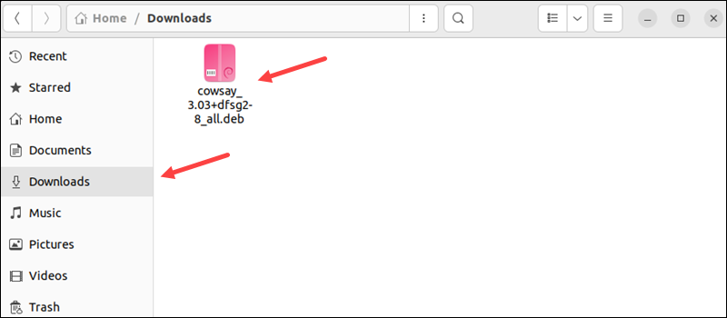
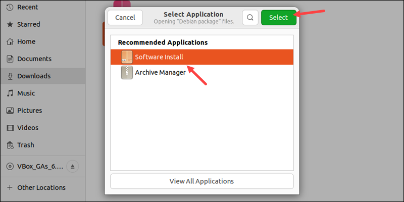
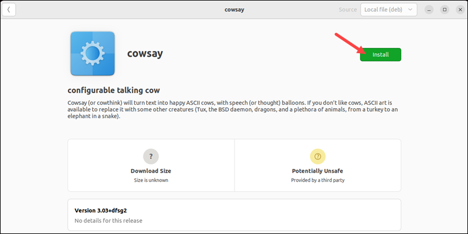
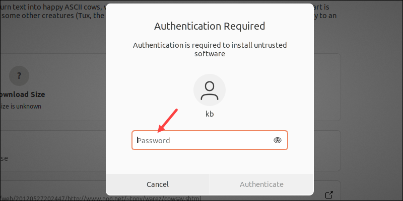
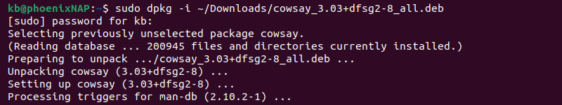
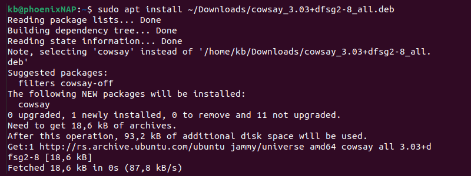
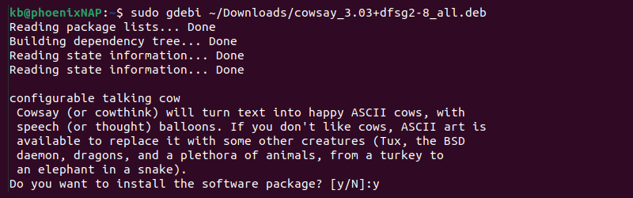

# Processus d'installation

[!ref icon="desktop-download" target="blank" text="Télécharger l'application"](https://github.com/cnumr/EcoindexApp/releases/latest)

## Commun

Après l'installation, lors du premier lancement, et lors des lancements suivant un ensemble d'actions et de vérifications sont réalisés.

Les éléments suivants seront vérifiés et installés :

- La présence de **NodeJS** et sa version ;
- Un **navigateur sans interface** (Chrome headless avec Puppeteer) pour réaliser les mesures ;
- **Notre outil de mesure** `lighthouse-plugin-ecoindex` (en réalité les packages `lighthouse-plugin-ecoindex-core` et `lighthouse-plugin-ecoindex-course`).

!!!warning
Vous devrez installer NodeJS manuellement si vous n'en avez pas déjà une version installée.  
 [Télécharger NodeJS](https://nodejs.org/fr/download)
!!!

<!--
Suivant votre configuration, des actions seront peut-être à réaliser manuellement, comme l'**installation de NodeJS**.

Toujours suivant votre configuration, **votre mot de passe administateur sera peut-être demandé** pour corriger un problème inhérent à l'installation manuelle de NodeJS sur Mac.

!!!info Mise à jour automatique
Une fois l'application installée, un système de mise à jour maintiendra l'application à jour. Il se pourrait à l'avenir que des modifications soient apportées et des actions pourront vous être demandée de nouveau.
!!!
-->

## Systèmes d'exploitation

### Windows

!!!warning 🚨 Point d'attention 🚨
Pour créer un installateur validé par Microsoft, il faut un compte développeur payant (400$/an), ce qui est impossible pour un projet bénévole/open-source.  
**Le téléchargement et l'installation seront donc un peu plus "complexe" que d'habitude**.
!!!

#### 1. Téléchargement

Suivant le navigateur utilisé (comme Edge), il vous demandera si vous êtes sûr de vouloir télécharger le fichier. Allez au bout des (ennuyeuses) questions.

| Etape 1                                                                                                      | Étape 2                                                                                        | Étape 3                                                                           |
| ------------------------------------------------------------------------------------------------------------ | ---------------------------------------------------------------------------------------------- | --------------------------------------------------------------------------------- |
|  Dans le menu :icon-kebab-horizontal:, Cliquez sur **Conserver** |  Cliquez sur **Afficher plus :icon-chevron-down:** |  Cliquez sur **Conserver quand même** |

#### 2. Installation

Une fois l'application `ecoindex-app-{version}-win32-x64-setup.exe` téléchargée, vous devrez double-cliquer sur le fichier pour lancer l'installation. Elle aussi vous posera des questions de sécurité.

| Etape 1                                                                                   | Étape 2                                                                         |
| ----------------------------------------------------------------------------------------- | ------------------------------------------------------------------------------- |
|  Cliquez sur **Insformations complémentaires** |  Cliquez sur **Exécuter quand même** |

### Mac (M1 ou Intel)

L'application étant signé avec un compte développeur, il n'y a pas d'actions spécifique à réaliser lors de l'installation ou lors du lancement. **Des actions pourront vous être demandées si besoin.**

### Linux

#### Ubuntu (.deb)

> Vous avez deux méthode pour installer l'application sous Ubuntu

##### Méthode 1: Software Center

Pour installer un paquet deb avec le Software Center (Ubuntu Software), suivez les étapes simples ci-dessous :

1. Localisez le paquetage deb téléchargé. Par défaut, le système stocke les fichiers téléchargés dans le répertoire _Downloads_.

2. Faites un clic droit sur le fichier deb et choisissez **Ouvrir avec une autre application**.

3. Sélectionnez **Software Installer** dans la liste des programmes.

Une nouvelle boîte de dialogue s'ouvre avec des détails sur le logiciel.

4. Cliquez sur le bouton **Installer** pour continuer.

5. Saisissez le mot de passe de l'utilisateur lorsque vous y êtes invité et appuyez sur **Entrée** pour vous authentifier.

6. Attendez la fin de l'installation. Une fois l'installation terminée, le logiciel est prêt à être utilisé.

##### Méthode 2: Installer les fichiers deb à l'aide du terminal

Le terminal Ubuntu permet d'installer des paquets en utilisant différents gestionnaires de paquets et commandes. Vous trouverez ci-dessous quelques options pour installer des paquets deb à l'aide de commandes du terminal.

**Option 1 : Commande dpkg**

La commande dpkg est un gestionnaire de paquets qui permet d'installer, de supprimer et de construire des paquets.

Pour installer un paquetage deb à l'aide de la commande dpkg, exécutez la commande suivante :

`sudo dpkg -i <chemin du paquet>`

Indiquez le mot de passe de l'utilisateur et attendez la fin de l'installation. Si un paquetage repose sur des dépendances non disponibles, la commande dpkg renvoie une erreur. Téléchargez les dépendances manuellement.

**Option 2 : Gestionnaire de paquets apt**

La commande apt lance le gestionnaire de paquets apt. Pour installer un paquet deb à l'aide de la commande apt, exécutez la commande suivante

`sudo apt install <chemin du paquet>`

Indiquez le mot de passe de l'utilisateur si on vous le demande. Le gestionnaire de paquets localise et installe automatiquement toutes les dépendances.

**Option 3 : Installateur de paquets GDebi**

L'outil GDebi fonctionne également comme un outil en ligne de commande pour l'installation de paquets. Pour installer un paquet deb avec GDebi en ligne de commande, exécutez ce qui suit dans le terminal :

`sudo gdebi <chemin du paquet>`

Appuyez sur Y pour confirmer l'installation et entrez le mot de passe de l'utilisateur.

#### Red Hat (.rpm)

Consulter leur documentation [ici](https://access.redhat.com/solutions/1189).

## :icon-bug: Problèmes et bugs

[Consulter la page dédiée.](10-problemes.md)
