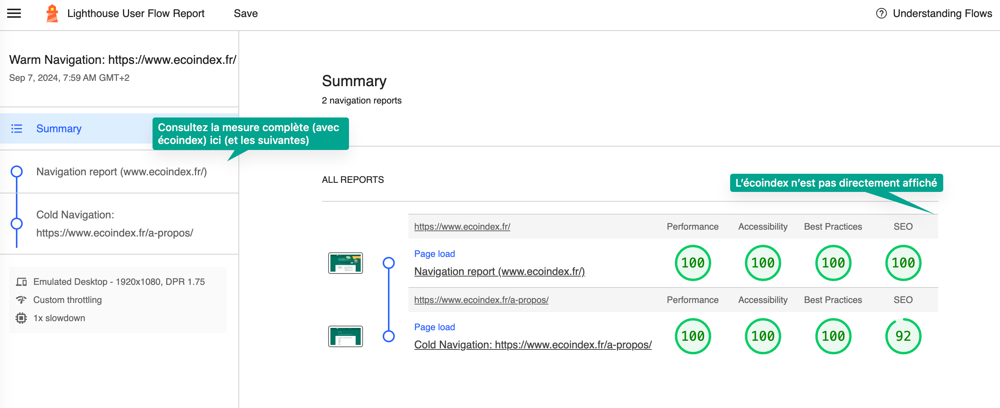
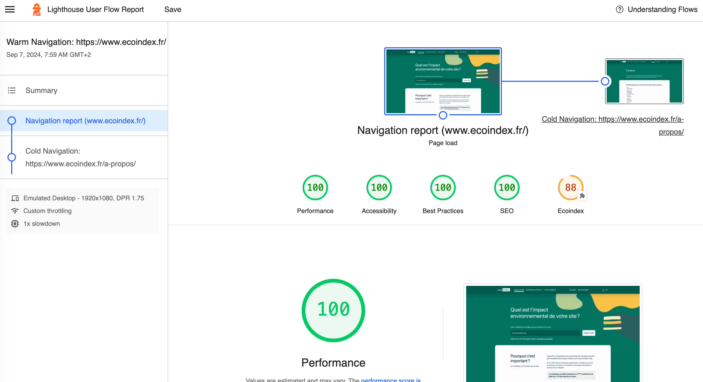
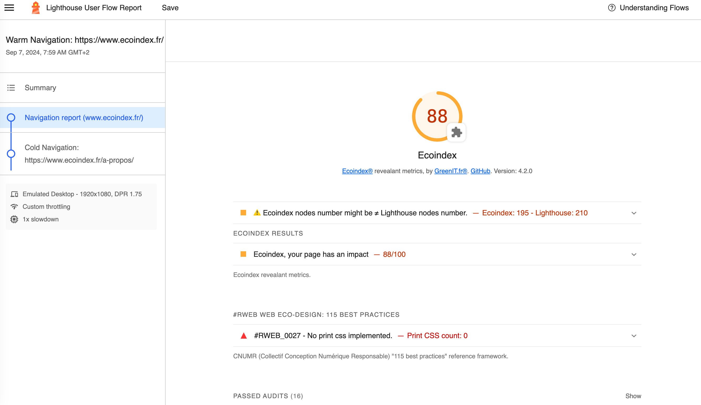

## Usage

Ce mode simple est le plus direct.

### Il permet d'obtenir :

- Les mesures d'impact environnementale multicritères de votre site ;
- Une évalation de la mise en oeuvre des bonnes pratiques du Green IT ;

### En générant :

- Un rapport HTML contenant les analyses Lighthouse et l'écoindex de GreenIT.fr®

## Utilisation

1. Spécifiez le dossier où vous voudrez sauvegarder les mesures ;
2. Saisissez la ou les URLS à tester ;
3. Cliquez sur mesurer et patientez ;
4. Votre navigateur web par défaut va se lancer pour afficher le resultat de la mesure. Les fichiers sont également sauvegardez, pour une consultation ultérieure dans le dossier spécifié à l'étape 1.

## Raports

