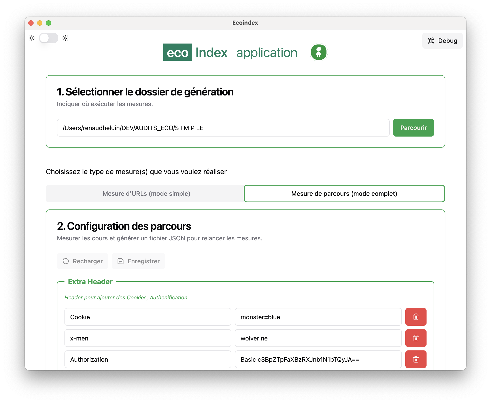
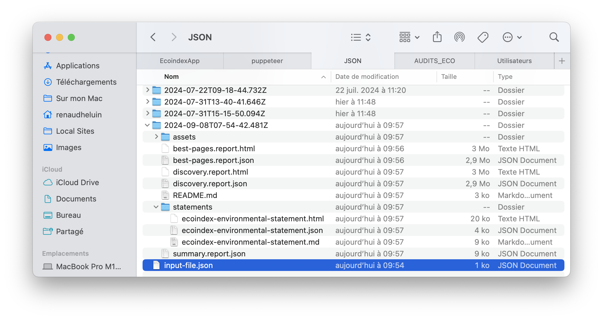

## Usage

Ce mode complet permet de mesurer des parcours entier.

Un fichier JSON sauvegarde vos paramètres afin de relancer simplement et de multiple fois la mesure de vos parcours pour visualiser l'évolution de l'impact écologique des pages, suite à vos actions.

### Il permet d'obtenir :

- Les mesures d'impact environnementale multicritères de votre site ;
- Une évalation de la mise en oeuvre des bonnes pratiques du Green IT.

### En générant :

- Des rapports HTML et JSON contenant les analyses Lighthouse et l'écoindex de GreenIT.fr®
- La Déclaration Environnementale de votre site – Environmental Impact Statement (EIS) – une initiative de GreenIT.fr®

## Utilisation

> Nous allons détailler l'écran de haut en bas.

### 1. Sélectionner le dossier de génération

Spécifiez le dossier où vous voudrez sauvegarder les mesures.

* Si le dossier est vide, une configuration par défaut est proposée, à adapter ;
* Si le dossier contient déjà un fichier de configuration, elle sera automatiquement rechargée et remplacera la configuration par défaut.

### 2. Configuration des parcours

#### Gestion du fichier de configuration

Les boutons `Recharger` / `Enregistrer` agissent sur le fichier de sauvegarde.

!!!info ⚡ Tip ⚡
Lors du lancement de la mesure, une sauvegarde du fichier JSON est automatiquement effectuée.
!!!

#### Extra-Header

Cette partie gère les données envoyées dans les headers de chaque chargement de page. Elle peut permettre de passer des paramètres d'authentifications, de gestion de cookies...

!!!info ⚡ Tip ⚡
Si vous n'en avez pas l'usage, vous pouvez mettre n'importe quoi, ça n'a pas d'impact direct sur la mesure.
!!!

#### Choisissez les rapports que vous souhaitez générer

- HTML: Les rapports Lighthouse au format HTML contenant l'écoindex ;
- JSON: Les rapports Lighthouse au format JSON contenant l'écoindex ;
- Statement : La déclaration environnementale.

!!!warning 🚨 Point d'attention 🚨
Si vous souhaitez générer la déclaration environnementale, la génération des fichiers JSON doit être obligatoirement sélectionnée.
!!!

#### Parcours

Vous pouvez ajouter et retirer des parcours, selon vos besoins.

**Composant d'un parcours :**

- **Nom du parcours** : obligatoire car servant au nom du fichier de sortie (HTML et JSON) ;
- **Objectif** : Information nécessaire pour la déclaration environnementale ;
- **Description** : Information nécessaire pour la déclaration environnementale ;
- **Parcours des Meilleurs pages** : Information nécessaire pour la déclaration environnementale, 1 seul parcours doit être identifié comme `Parcours des Meilleurs pages` ;
- **Urls à mesurer** : Vous pouvez ajouter et retirer des URLS, selon vos besoins.

#### 3. Lancer la mesure

1. Cliquez sur mesurer et patientez ;
2. Contrairement à la mesure simple, votre navigateur web ne vas pas se lancer, vu que plusieurs fichiers vont être générés. Votre explorateur de fichier s'ouvrira, à la racine du dossier spécifié au point 1.

## Raports

**Contenu du dossier racine**

- **input-file.json** : Le fichier de configuration de mesure de parcours ;
- Des dossiers contenant vos mesures, au format date & heure.

**Contenu d'un dossier de mesure**

> On part du postulat que vous effectué 1 mesure de 2 parcours, nommé "Best pages", "Discovery". Vous avez demandez la génération des fichiers HTML, JSON et la déclaration environnementale.

- `*.report.html` : Les rapports Lighthouse+ecoindex HTML :
  - best-pages.report.html ;
  - discovery.report.html ;
- `*.report.json` : Les rapports Lighthouse+ecoindex JSON :
  - best-pages.report.json ;
  - discovery.report.json ;
- `summary.report.json` : Une version simplifié et fusionné des fichiers `*.report.json` ;
- Fichiers statements pour la déclaration environnementale (EIS) :
  - Un fichier `README.md` expliquant comment utiliser l'EIS ;
  - Un dossier `assets` contenant des éléments images ;
  - Un dossier `statements` contenant 3 versions de l'EIS :
    - `.html`
    - `.md` (Markdown)
    - `.json` La version JSON du EIS doit être déposé à la racine du site, afin d'être consultable suivant cette URL type `https://domain.tld/ecoindex-environmental-statement.json` (domain.tld est à remplacer par votre nom de domain).

!!!info La version JSON du EIS
Ce fichier est généré en prévision d'une lecture automatisée des EIS par des bots.
!!!