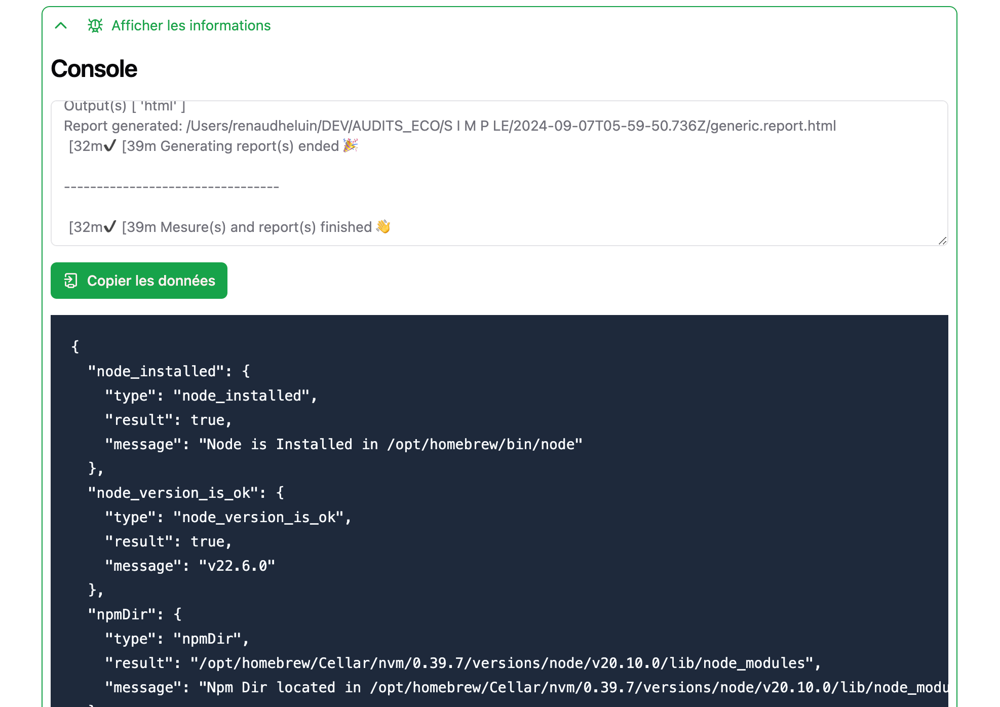

# :icon-bug: Problèmes et bugs

La multiplicité des configurations possibles et les différentes systèmes d'exploitation ont été testés, mais il y a peut-être des "trous dans la raquette".

!!!warning Linux
L'application reste à tester et la documentation à écrire.  
**N'hésitez pas à nous faire des retours !**
!!!

Si vous rencontrez un problème au lancement de l'application, n'hésitez pas à nous contacter à renaud@greenit.fr.

Envoyez le contenu du fichier `log` que vous pourrez consulter depuis l'application dans `Aide/Help > Log...`

## Déterminer les problèmes ou voir ce qui se passe dans l'application.

Vous trouverez en bas de l'application, un élément qui peut se plier/déplier (:icon-bug:`Afficher les informations`).

Vous y touverez la console (ce que retourne `lighthouse-plugin-ecoindex`) et les éléments testés et retournés lors du lancement de l'installation (que l'on peut retrouver dans les logs).

