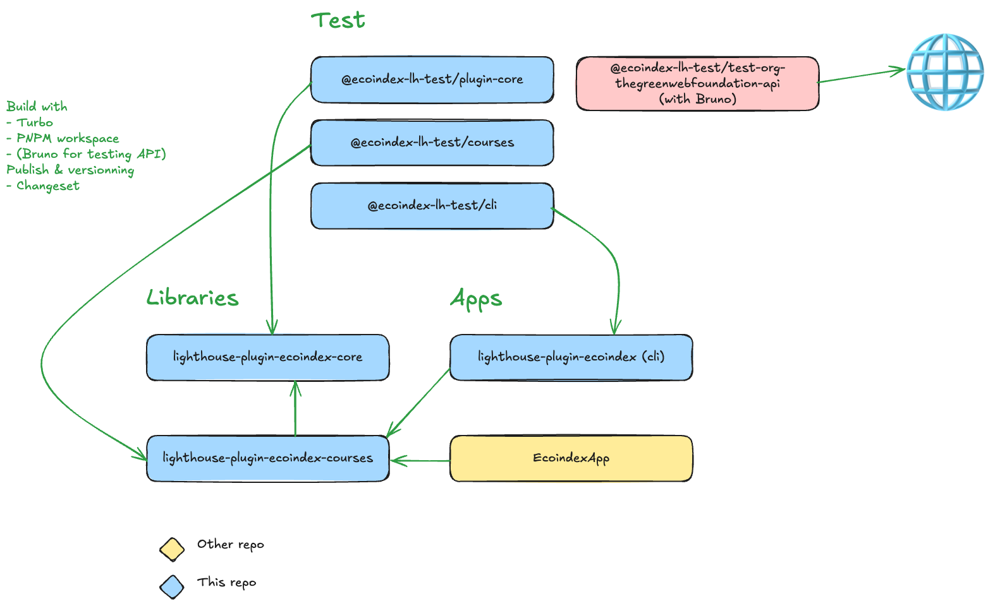

## Description

Ce projet est un monorepo qui contient les différents packages du plugin-lighthouse-ecoindex.

## Packages et applications

- [lighthouse-plugin-ecoindex-core](https://github.com/cnumr/lighthouse-plugin-ecoindex/tree/main/libs/ecoindex-lh-plugin-ts) => package principal du plugin-lighthouse-ecoindex. Il contient les fonctionnalités principales d'un plugin lighthouse et ajoute les fonctionnalités spécifiques à l'écoindex.
- [lighthouse-plugin-ecoindex-course](https://github.com/cnumr/lighthouse-plugin-ecoindex/tree/main/libs/ecoindex-lh-courses) => package pour gérer les mesures d'écoindex, utilisée par l'application de ligne de commande et EcoindexApp.
- [lighthouse-plugin-ecoindex-cli](https://github.com/cnumr/lighthouse-plugin-ecoindex/tree/main/apps/ecoindex-lh-cli) => application de ligne de commande pour lancer les audits.
- [EcoindexApp](https://github.com/cnumr/EcoindexApp) => application pour lancer les audits et gérer les résultats [plus d'informations](../application/00-index.md).

## Stack

