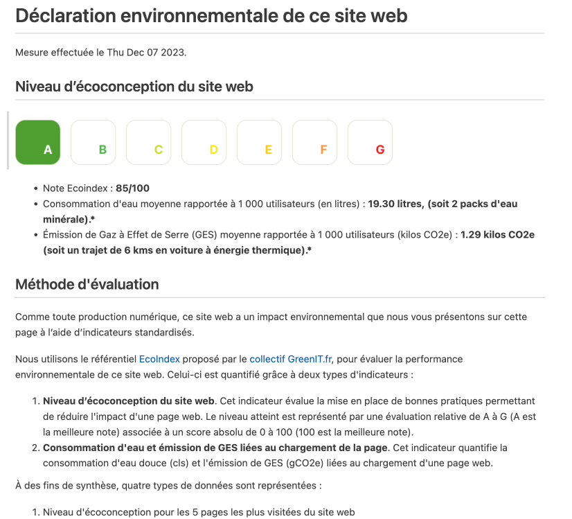
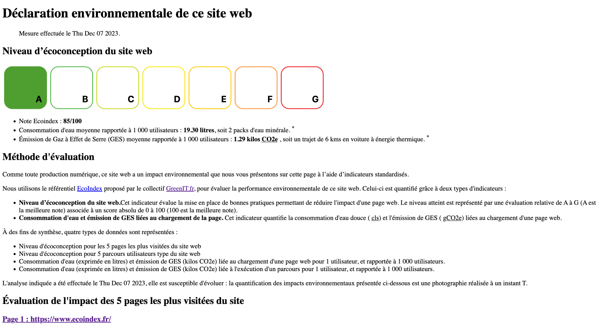

# Déclaration Environnementale, l'initiative de GreenIT.fr®

## Objectifs et principes de la déclaration d'impact

Comme toute production numérique, un site web a des impacts environnementaux qui peuvent être mesurés, affichés et réduits.

Ce projet de déclaration environnementale a vocation à établir une méthode commune pour l'évaluation des impacts des sites web sur l’environnement, et ce dans le but de créer deux effets vertueux :

- Permettre aux utilisateurs finaux de faire des arbitrages quant à leur consommation numérique, par exemple en choisissant, pour un service donné, le site web le moins impactant pour la planète.
- Aider les éditeurs de site à réduire l’impact de leur production sur l’environnement, en leur donnant les outils et méthodes pour mesurer et minimiser cet impact, ainsi qu’un référentiel commun.

!!!info Déclaration Environnementale, l'initiative de GreenIT.fr®
[!button target="blank" icon="checklist" iconAlign="right" text="Découvir"](https://declaration.greenit.fr/)
!!!

---

## Les exports proposés par l'outil `lightouse-ecoindex`

!!!info
L'export `HTML` provient du site de [Déclaration Environnementale (page gabarits)](https://declaration.greenit.fr/realiser-votre-declaration/2.-telecharger-un-gabarit-de-page). La version `Markdown` est une version adaptée de la version `HTML`.
!!!

### Version Markdown

Cette version peut-être ajoutée à votre CMS si il prend en charge le Markdown. L'ÉcoIndex est affiché sous forme image.

==- Capture d'écran de la version Markdown

===

### Version HTML

La version HTML peut-être ajouter directement à votre site web.

!!!warning
Vous pouvez adapter le style CSS à votre charte graphique, mais il est important de conserver les classes CSS pour que le rendu et les codes couleurs de l'Ecoindex soit correctement affiché.
!!!

==- Capture d'écran de la version HTML

===

### Version JSON

La version JSON est un export normalisé des données brutes de l'outil. Son objectif est d'être utilisé pour des traitements automatisés (bot). Comme le sont des fichiers tels que `robots.txt` ou `sitemap.xml`.

==- Exemple de fichier de déclaration pour les bots `ecoindex-environmental-statement.json`

:::code source="./static/ecoindex-environmental-statement.json" :::

===
