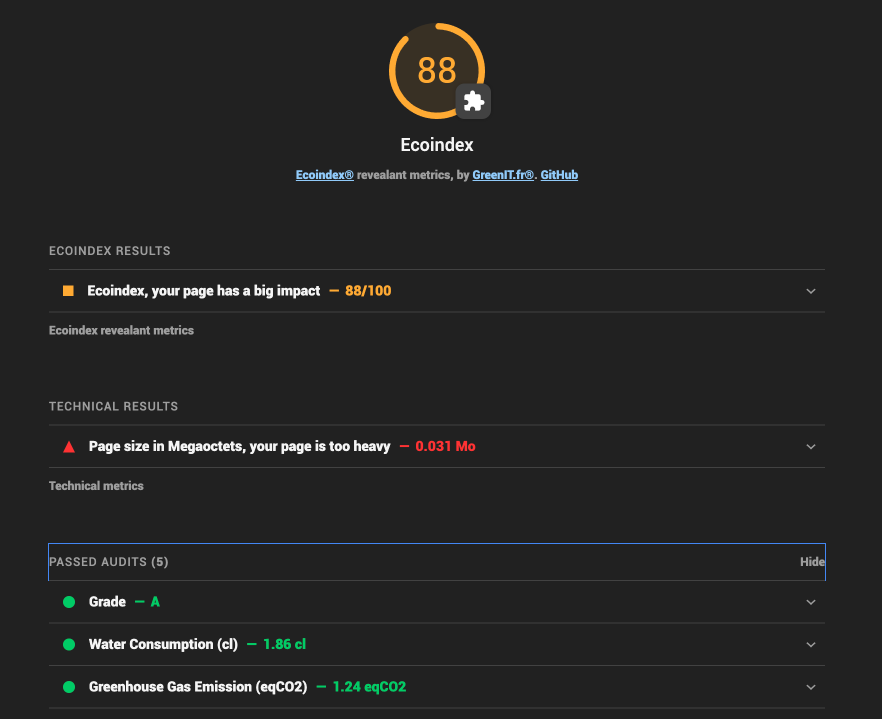

_Summary of results_

# Lighthouse Plugin Ecoindex Core en TS

## Description

Plugin pour Lighthouse qui calcule l'Ecoindex des pages web.

Il peut être utilisé directement avec `lighthouse-ci` en tant que plugin.


_Details of plugin results_

[Full documentation and examples](https://cnumr.github.io/lighthouse-plugin-ecoindex/)

## changelog

Voir le [changelog](./libs/ecoindex-lh-plugin-ts/CHANGELOG.md)

## Installation

```bash
npm install lighthouse-plugin-ecoindex-core
```

## Usage

Voir le projet [@ecoindex-lh-test/plugin-core (test-ecoindex-lh-plugin-ts)](../../test/test-ecoindex-lh-plugin-ts/README.md)

## Audits RWEB — Référentiel GreenIT 5.0

Le plugin inclut 18 audits basés sur le [référentiel RWEB 5.0](https://rweb.greenit.fr) :

| ID audit | RWEB | Description |
|---|---|---|
| `rweb-no-animations` | RWEB_0009 | Éviter les animations CSS/JS |
| `rweb-no-carousel` | RWEB_0010 | Limiter le recours aux carrousels |
| `rweb-title-meta` | RWEB_0011 | Titre de page et meta description pertinents |
| `rweb-print-css` | RWEB_0031 | Fournir une feuille de style pour l'impression |
| `rweb-limit-fonts` | RWEB_0032 | Préférer les polices standard |
| `rweb-no-embedded-docs` | RWEB_0033 | Ne pas afficher de documents dans les pages |
| `rweb-css-containment` | RWEB_0039 | Utiliser la propriété CSS `contain` _(vérification manuelle)_ |
| `rweb-no-inline-assets` | RWEB_0042 | Externaliser les CSS et JavaScript |
| `rweb-no-canvas` | RWEB_0055 | Limiter le recours aux canvas |
| `rweb-no-social-sdk` | RWEB_0059 | Remplacer les boutons officiels de partage social |
| `rweb-service-worker` | RWEB_0060 | Économiser de la bande passante via un Service Worker |
| `rweb-no-cookie-on-static` | RWEB_0081 | Héberger les ressources statiques sur un domaine sans cookie |
| `rweb-limit-domains` | RWEB_0082 | Limiter le nombre de domaines servant les ressources |
| `rweb-hsts` | RWEB_0084 | Favoriser HSTS preload aux redirections 301 |
| `rweb-no-gif` | RWEB_0099 | Limiter l'utilisation des GIFs animés |
| `rweb-no-autoplay` | RWEB_0106 | Éviter la lecture automatique des vidéos et sons |
| `rweb-limit-analytics` | RWEB_0111 | Limiter les outils d'analytics et les données collectées |
| `rweb-no-redirects` | RWEB_0112 | Éviter les redirections |

### Mettre à jour les URLs de référence RWEB

Les URLs des fiches RWEB sont stockées dans `src/audits/bp/refs-urls.ts`. Pour les régénérer depuis l'API `rweb.greenit.fr` :

```bash
# Version latest
pnpm refs:update

# Version spécifique du référentiel
pnpm refs:update:version -- 2.0.0
```
