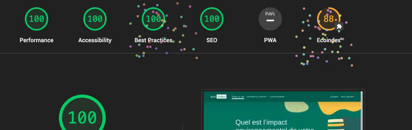

# Plugin [Ecoindex](https://www.ecoindex.fr) pour [Lighthouse](https://github.com/GoogleChrome/lighthouse)

 

## Introduction

Ce plugin ajoute EcoIndex® à Lighthouse®.

### Il permet d'obtenir :

- Les mesures d'impact environnementale multicritères de votre site ;
- Une évalation de la mise en oeuvre des bonnes pratiques du Green IT ;

### En générant :

- Des rapports HTML, JSON ou la Déclaration Environnementale de votre site – Environmental Impact Statement (EIS) – une initiative de GreenIT.fr®
- Des résultats automatiquement ajoutés à votre CI/CD ou un à serveur Lighthouse.

### Il peut être utilisé de quatre manières différentes :

- En ligne de commande `npx lighthouse-plugin-ecoindex <command> <options>` avec le cli fourni par le plugin ;
- Avec [Lighthouse cli](https://github.com/GoogleChrome/lighthouse#using-the-node-cli) `npm lighthouse <url> <options>` ;
- Avec [Lighthouse CI](https://github.com/GoogleChrome/lighthouse-ci#readme) ;
- Avec l'application compagnon [EcoindexApp](https://github.com/cnumr/EcoindexApp/releases/latest), installable et utilisable **sans limitations** sur votre ordinateur.

### En respectant des contraintes permettant :

- D'avoir des mesures réalistes et où les éléments des pages sont chargés (images, scripts, polices, etc.) ;
- D'avoir des mesures normalisées entre chaque exécution ;
- D'obtenir des mesures comparables entre les sites.

### Les contraintes / process reproductible :

!!!success 👉 Comportement de l'utilisateur

1. Lancez un navigateur Chrome sans tête avec les capacités no-sandbox, disable-dev-shm-usage et goog:loggingPrefs définies sur {"performance" : "ALL"}.
2. Ouvrez la page sans données locales (cache, cookies, localstorage...) à une résolution de 1920 × 1080px.
3. Attendez 3 secondes
4. Faites défiler la page jusqu'en bas
5. Attendez encore 3 secondes
6. Fermer la page
   !!!

> Lors de la mesure d'un parcours utilisateur, le cache est vide au début du parcours, mais est conservé et réutilisé tout au long du parcours, si il est mise en place par le site (Bonne pratique).

!!!info Déclaration Environnementale, l'initiative de GreenIT.fr®
[!button target="blank" icon="checklist" iconAlign="right" text="Découvir"](https://declaration.greenit.fr/)
!!!

## Récapitulatif des fonctionnalités

- [!button size="xs" text="cli (int)" icon="terminal"](./guides/1-lighthouse-ecoindex-cli.md) client interne `npx lighthouse-plugin-ecoindex <command> <options>` ;
- [!button size="xs" text="CI" icon="pulse"](./guides/3-lighthouse-ci.md) Lighthouse CI ;
- [!button size="xs" text="cli (lh)" icon="terminal"](./guides/2-lighthouse-cli.md) client Lighthouse **[Usage non recommandé]** `npm lighthouse <url> <options>`.

| Fonctionnalités                                          | :icon-terminal: cli(int) | :icon-pulse: CI | :icon-terminal: cli(lh) |
| :------------------------------------------------------- | ------------------------ | --------------- | ----------------------- |
| ⚠️ Recommandation d'usage                                | ✅                       | ✅              | ❌                      |
| Rapports Lighthouse avec les audits ecoindex             | ✅                       | ✅              | ✅                      |
| Bonnes pratiques Green IT                                | ✅                       | ✅              | ✅                      |
| Déclaration Environnementale                             | ✅                       | ❌              | ❌                      |
| Publication des données d'audits à un serveur Lighthouse | ❌                       | ✅              | ❌                      |
| Puppeteer                                                | ✅                       | ✅              | ❌                      |

## Documentation des usages

[!ref icon="terminal" text="lighthouse-plugin-ecoindex CLI"](./guides/1-lighthouse-ecoindex-cli.md)
[!ref icon="terminal" text="Lighthouse CLI"](./guides/2-lighthouse-cli.md)
[!ref icon="pulse" text="Lighthouse CI"](./guides/3-lighthouse-ci.md)
[!ref icon="device-desktop" text="EcoindexApp"](./application/00-index.md)

